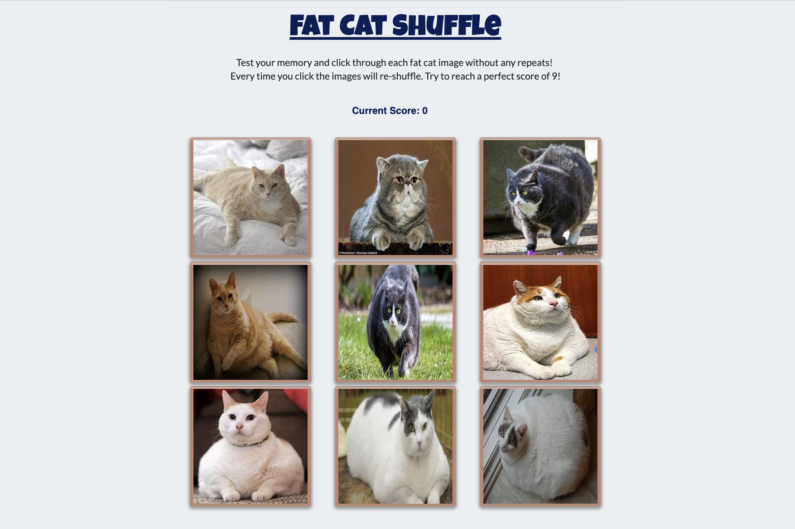

# **Clicky Game**

## **Overview**
For this assignment, I created a memory game with React. This assignment required me to break up my application's UI into components, manage component state, and respond to user events.

**Submission on BCS**
This assignment must be deployed. * Please submit both the deployed GitHub Pages link to your homework AND the link to the Github Repository! You can view the page here: [github.clicky-game](https://github.com/djreichel/clicky-game/blob/master/public/index.html)

**Instructions**
Create a new React application using Create React App.
The application should render different images (of your choice) to the screen. Each image should listen for click events.
The application should keep track of the user's score. The user's score should be incremented when clicking an image for the first time. The user's score should be reset to 0 if they click the same image more than once.
Every time an image is clicked, the images rendered to the page should shuffle themselves in a random order.
Once the user's score is reset after an incorrect guess, the game should restart.
When complete, the application should be deployed to Github Pages. See the README generated with Create React App for instructions on deploying the application to Github Pages.

**Minimum Requirements**
This assignment must be deployed. Attempt to complete homework assignment as described in instructions. If unable to complete certain portions, please pseudocode these portions to describe what remains to be completed. Hosting on Github Pages and adding a README.md are required for this homework. In addition, add this homework to your portfolio. More information can be found below.

**Create a README.md**
You're reading it now.

**Add To Your Portfolio**
After completing the homework, I added the piece to my bootcamp portfolio. You can view the page here: [github.portfolio](https://djreichel.github.io/Bootstrap-Portfolio/portfolio.html)
